### Prueba de CORS:

Para verificar que CORS funciona correctamente, añade el endpoint en el path `/cors-prueba/` y haz clic en el botón "Probar CORS". La página realizará una petición AJAX al endpoint `/api/v1/prueba-cors/` y mostrará el resultado.

Aclaraciones sobre puntos realizados:

Hacer dos peticiones GET donde se tenga en cuenta el usuario logueado y que usa el token (1 punto)
Hacer dos peticiones POST donde se tenga en cuenta el usuario logueado y que usa el token, y no tengas que indicarlo en el formulario cliente (1 punto)

Las operaciones GET son el perfil de usuario y sus albumes, puede acceder desde aquí una vez logueado:
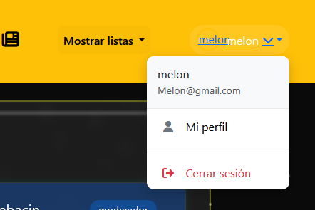

Las peticiones POST son dos:

el botón de seguir usuario en las tarjetas de usuario:
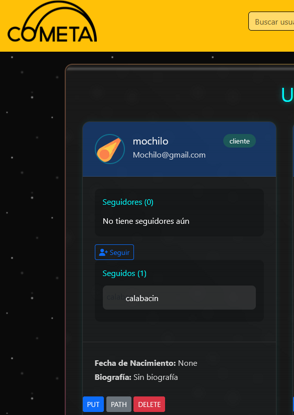

El botón de like en las tarjetas de canciones:
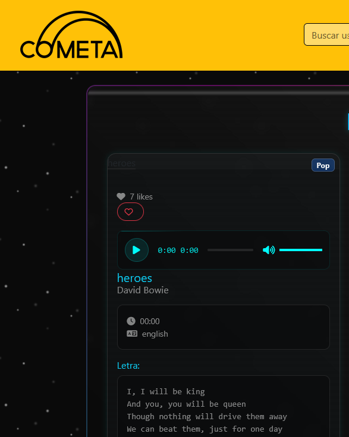

### Tutorial de SocialSound - Cliente

# Introducción

SocialSound es una plataforma para compartir música y socializar con otros usuarios. Esta aplicación cliente se conecta a una API REST.

# Requisitos previos

Antes de comenzar, asegúrate de tener instalado:

Python 3.8 o superior
pip (administrador de paquetes de Python)
Un navegador web moderno (Chrome, Firefox, etc.)
Git (opcional, para clonar el repositorio)

Pasos para usar el proyecto desdd git:

Descargamos proyecto con GIT
sudo apt-get install python3-venv  -> Sino está instalado ya
No situamos en la carpeta 2daw
python3 -m venv myvenv -> Creamos el entorno
source myvenv/bin/activate
python -m pip install --upgrade pip
pip install -r requirements.txt
python manage.py migrate -> Creamos base de datos
python manage.py runserver 0.0.0.0:8080 -> Lanzamos el servidor

# Instalación

1. Clona este repositorio (o descarga el código fuente):

        git clone https://github.com/AlumnoSoloYolo/socialSound_cliente.git
        cd socialSound_cliente

2. Crea un entorno virtual y actívalo:

        # En Windows
        python -m venv venv
        venv\Scripts\activate

        # En macOS/Linux
        python3 -m venv venv
        source venv/bin/activate

3. Instala dependencias:

        pip install -r requirements.txt

# Configuración

Crea un archivo .env en la raíz del proyecto con la siguiente configuración:

    SECRET_KEY=tu_clave_secreta_aqui
    DEBUG=True
    API_BASE_URL=https://lolosoloyolo.pythonanywhere.com/
    API_VERSION=api/v1/
    API_MEDIA_URL=https://lolosoloyolo.pythonanywhere.com/media/

Puedes generar una clave secreta con:

    python -c "import secrets; print(secrets.token_urlsafe(32))"

Configura la base de datos por defecto:

    python manage.py migrate

# Iniciar la aplicaicón

Inicia la aplicación:

    python manage.py runserver

Abre tu navegador y accede a: 
    
    http://127.0.0.1:8000/

La primera página que aparece es el registro:

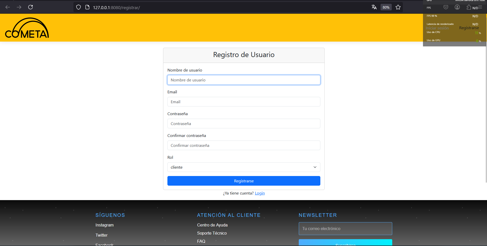

Creamos un usuario y e iniciamos sesion introduciendo nuestras credenciales en la página de login:

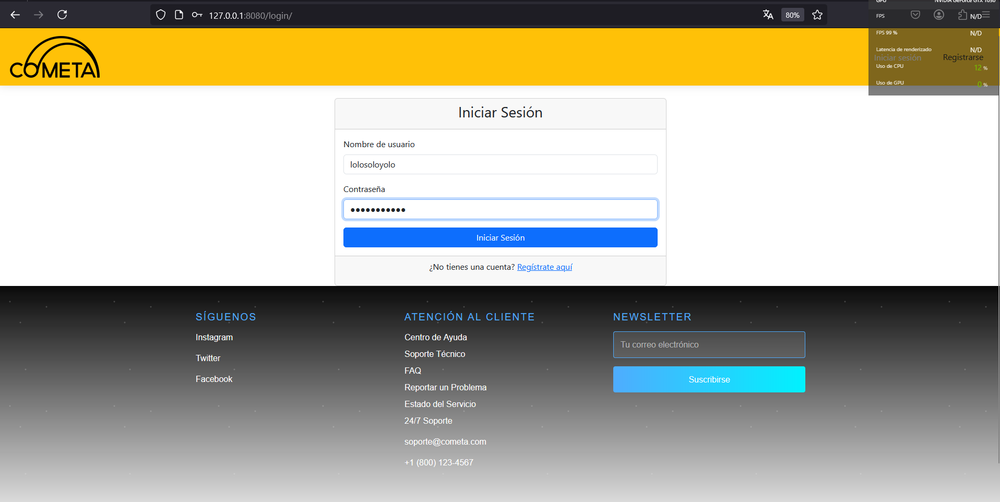

Una vez logueados nos redirijá aquí:

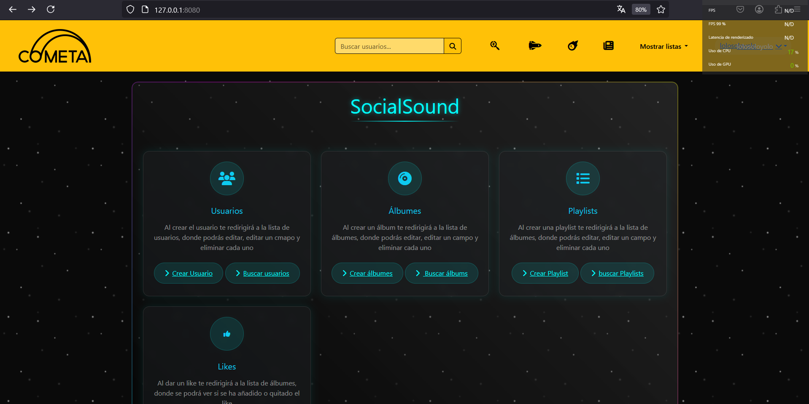

Para realizar peticiones GET, PUT, POST, DELETE:

    GET

Listar Usuarios

Navega a "Ver usuarios" en la parte superior derecha en el menú desplegable de la barra de navegación.

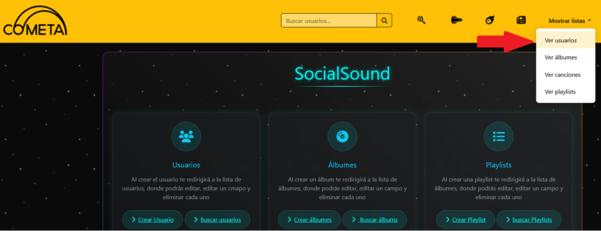

Si hacemos click veremos una lista completa de todos los usuarios registrados:

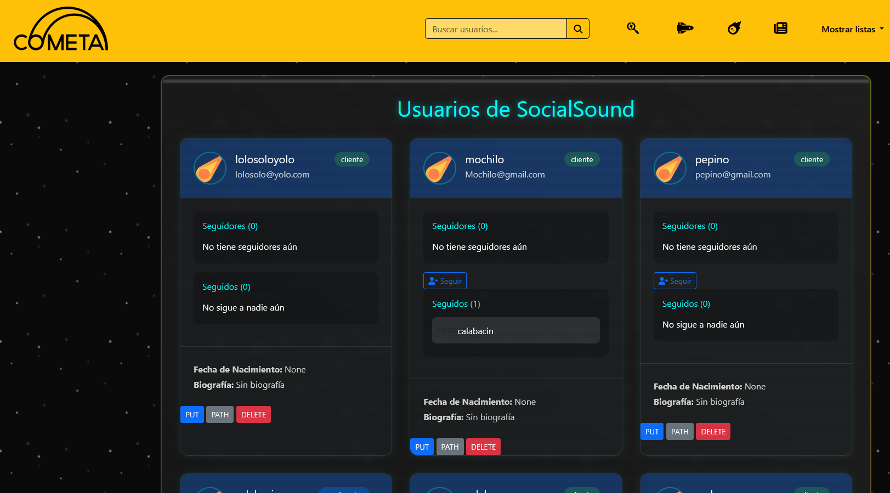

    POST

Para crear un album por ejemplo hacemos click aquí:

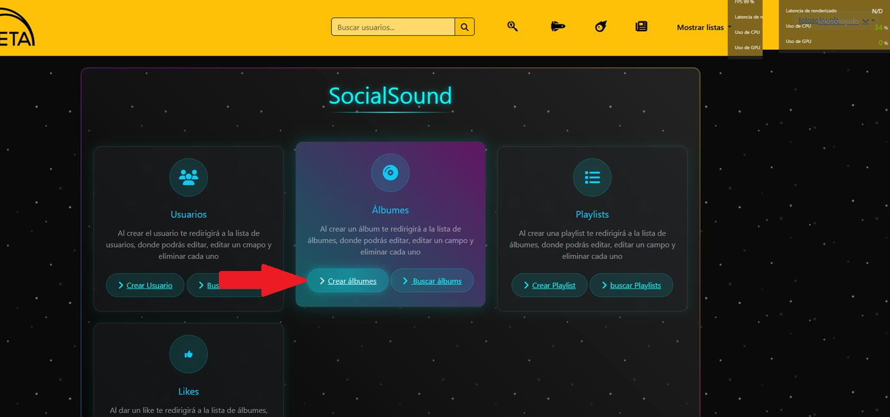

Y rellenamos el formulario:

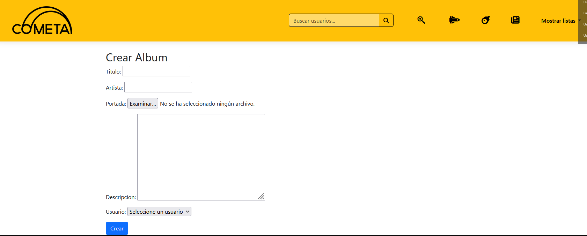

    PUT, PATH, DELETE

La tarjeta del usuario con el que nos hemos regsitrado y logeado tiene distintos botones para realizar las operaciones de path, put y delete.

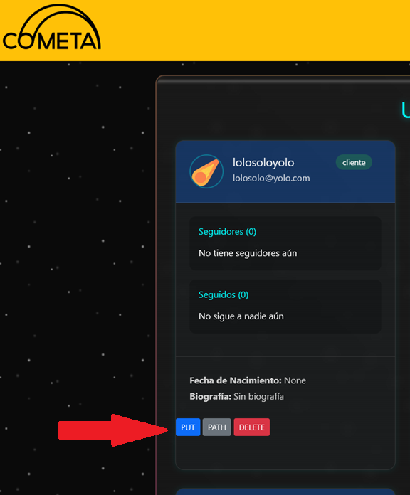

para realizar un PUT hacemos click sobre PUT y nos aparecerá el siguiente formulario a rellenar:

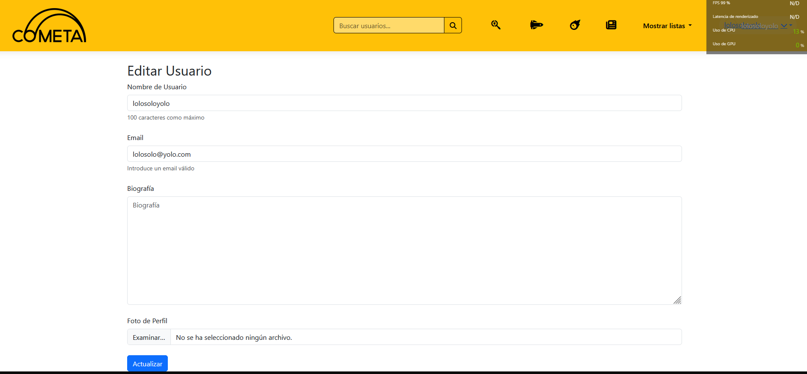

Lo mismo con PATH:

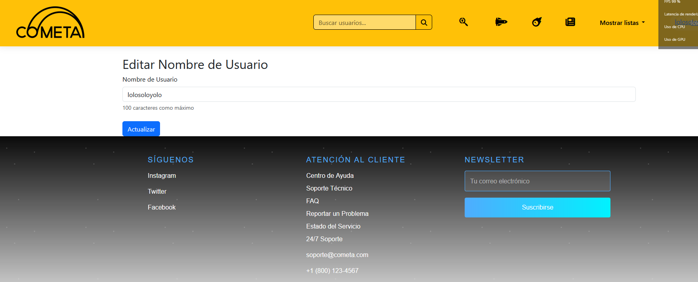

Y al hacer click en delete:

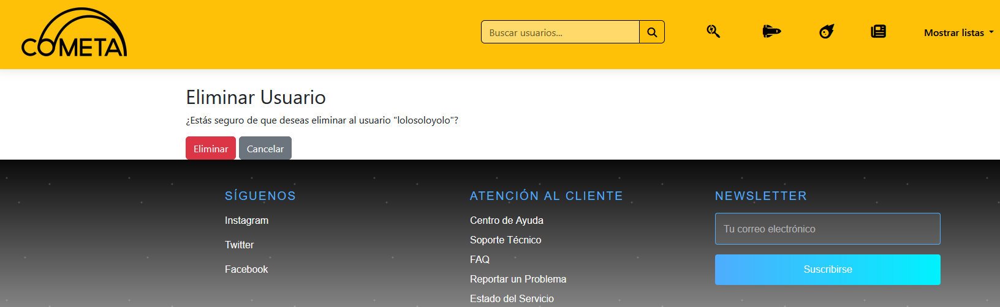

Presionamos eliminar para confirmar.

